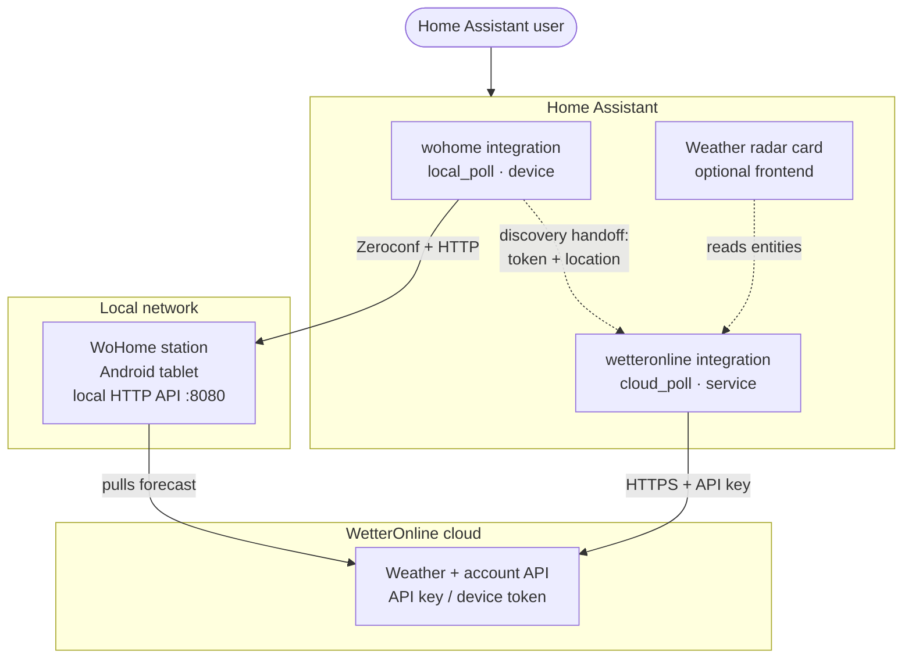
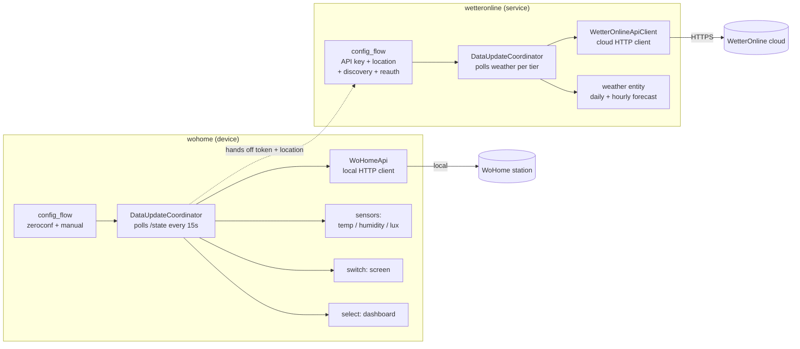
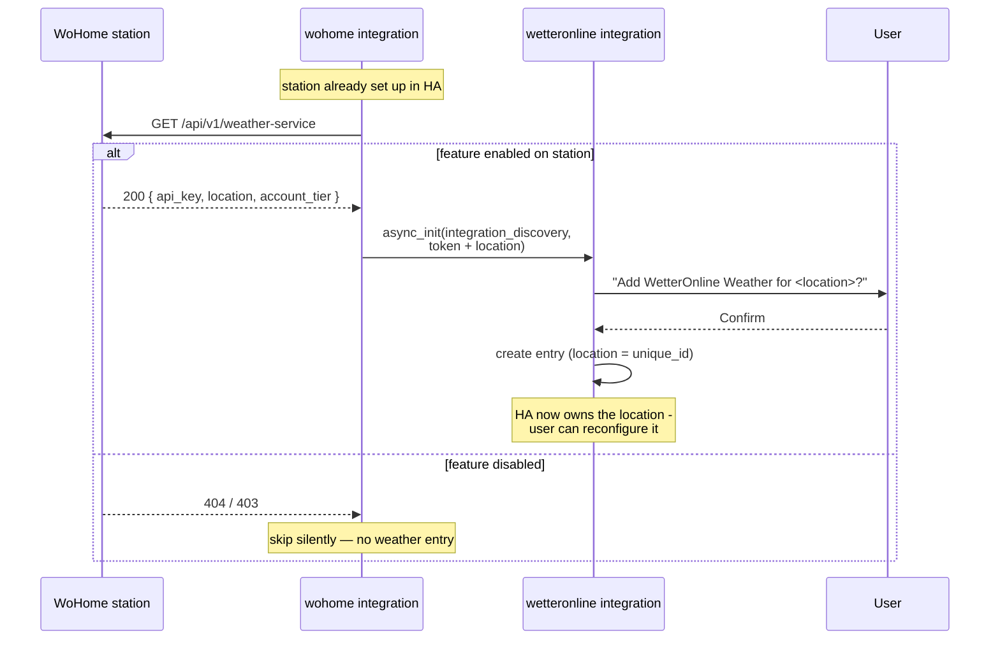

# Architecture overview

## Abstract

The WetterOnline Home Assistant offering is built from **two independent
integrations** plus an optional frontend card, rather than one combined
component. This split follows Home Assistant's core modeling rule: a *device*
integration represents a physical device on the local network, while *weather
for a location* is a cloud service.

- **`wohome`** is a local-polling **device** integration. It talks to a
  WoHome weather-station tablet over a local HTTP API (discovered via Zeroconf)
  and exposes the station's own hardware: indoor temperature, humidity and
  ambient-light sensors, a screen on/off switch, and a selector that pushes a
  Home Assistant dashboard URL to the tablet.

- **`wetteronline`** is a cloud-polling **service** integration. It fetches
  WetterOnline forecast data for a chosen location directly from the
  WetterOnline servers using an API key, and exposes a standard Home Assistant
  `weather` entity. It works for everyone, with or without a station.

The two are connected only by an optional **discovery handoff**: a station that
has the feature enabled can hand the `wetteronline` integration a
device-scoped API token and a default location, so station owners get a
near-zero-setup weather entity. Crucially, the forecast data does **not** flow
through the tablet — the tablet only bootstraps credentials. Home Assistant
becomes the source of truth for the configured location, which avoids the
problems of multiple stations, differing station locations, and users without a
station.

A future weather-radar Lovelace card is a separate frontend project that
consumes whatever entities and tile URLs the `wetteronline` integration exposes;
it does not affect either integration.

## System context

## Component view of the integrations

## Discovery handoff sequence

How a station owner gets a weather entity with no manual key entry:

## Key decisions

- **Two integrations, not one.** Keeps each aligned with its Home Assistant
  archetype (device vs. service) and lets non-station users consume weather.
- **Tablet bootstraps credentials, never carries data.** Removes the
  multi-station, wrong-location, and no-station failure modes.
- **Location lives in Home Assistant.** The station's location is only a
  default; the user can override it and HA remains authoritative.
- **Device-scoped, revocable token** for the handoff, distinct from the raw
  account API key, so a lost tablet can be revoked without rotating the key.
